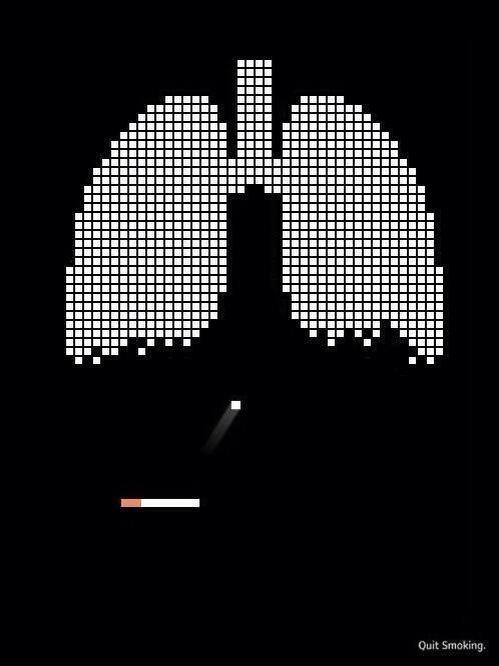

# Breakout of Smoking 🚭

_Breakout of Smoking_ is a programming-as-art
[Breakout clone](https://en.wikipedia.org/wiki/Breakout_clone) with an
anti-smoking theme.

## Controls

- _Left arrow_: move the paddle (cigarette) to the left.
- _Right arrow_: move the paddle (cigarette) to the right.

## Inspiration

The inspiration for this project is the anti-smoking poster seen below:

